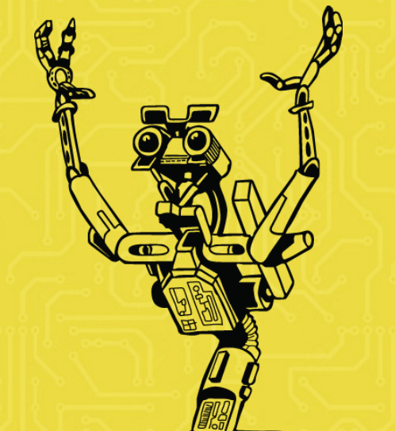
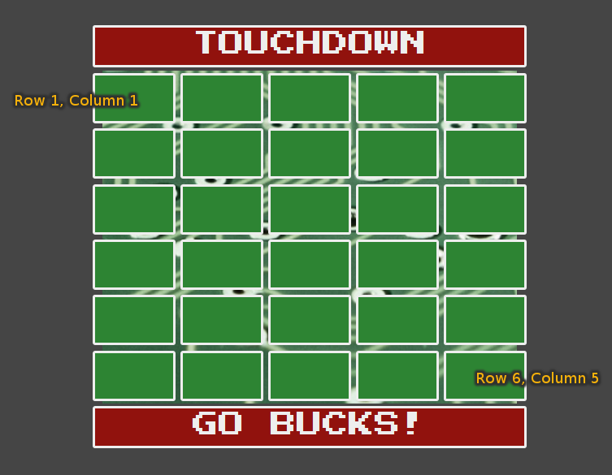

author: Lauren Holloway & Brian Forsythe<br />
title: Buckeye MazeSweeper
subtitle: Learn to Code: JavaScript
theme: league
# What can JavaScript do?

<h3 class="fragment">Originally created to support dynamic web pages</h3>

<ul>
	<li class="fragment">interacting with the user<br />(clicks, keypresses, prompts)</li>
	<li class="fragment">adding, removing, altering page elements<br />(manipulating the <strong>D</strong>ocument <strong>O</strong>bject <strong>M</strong>odel)</li>
</ul>

<p class="fragment">It is ubiquitous today, one of the most popular programming languages.</p>

# Examples

## Animation

<iframe src="./examples/circles/index.html" style="background-color: #ffffff; width: 80rem; height: 30rem;">No frame support</iframe>
<small>(Example courtesy of <a href="http://gwennaelbuchet.github.io/SceneGraph.js" target="_blank">SceneGraph.js Framework</a>)</small>

## Games

<iframe src="./examples/catchTheFlowers/index.html" style="background-color: #ffffff; text-align: center; width: 480px; height: 320px;">No frame support</iframe>
<small>(Example courtesy of <a href="http://gwennaelbuchet.github.io/SceneGraph.js" target="_blank">SceneGraph.js Framework</a>)</small>

## Charts and Graphs

<canvas id="myChart" style="background-color: #eee;"></canvas>
<p><a href="http://chartjs.org">Chart.js</a></p>

<script src="https://cdnjs.cloudflare.com/ajax/libs/Chart.js/2.1.4/Chart.min.js"></script>
<script>
var ctx = document.getElementById('myChart').getContext('2d');
var myChart = new Chart(ctx, {
  type: 'line',
  data: {
    labels: ['M', 'T', 'W', 'T', 'F', 'S', 'S'],
    datasets: [{
      label: 'apples',
      data: [12, 19, 3, 17, 6, 3, 7],
      backgroundColor: "rgba(10, 201, 0, 0.4)"
    }, {
      label: 'oranges',
      data: [2, 29, 5, 5, 2, 3, 10],
      backgroundColor: "rgba(248, 112, 0, 0.4)"
    }]
  }
});
</script>

## Calculator

<iframe src="./examples/calculator/index.html" style="width: 22rem; height: 22rem;">No frame support</iframe>

## This presentation

*Wow, that's meta.*

<small><a href="https://github.com/WCCI-Learn-to-Code/buckeye-mazesweeper">https://github.com/WCCI-Learn-to-Code/buckeye-mazesweeper</a></small>

## Showing up in places we never expected

<div class="fragment">
<h3>Outside of the browser</h3>


<p><a href="https://nodejs.org">https://nodejs.org</a></p>
</div>

## Internet of Things (IoT)

<div style="float: left; width: 20rem;">

</div>

<div class="fragment">
	<div style="float: right; width: 20rem;">
		
	</div>
	<div style="clear: right; float: right;">
		<h3>Like Johnny-Five!</h3>
		<p><a href="http://johnny-five.io" target="_blank">http://johnny-five.io</a></p>
	</div>
</div>

# On With the Show!

## Demo

## Create Your Own

Open <a href="http://codepen.io/pen?template=mWgGwe">http://codepen.io/pen?template=mWgGwe</a> in your browser.

## Let's Set Our Goals

- Reveal the background image as correct spaces are clicked.
- Require that spaces are clicked in the correct order.
- Remove a retry (football) when an incorrect space is clicked.
- Display "Game Over" message when there are no retries remaining.
- *Bonus:* Reset the game when "Start" is clicked.

# Let's Write JavaScript!

We write JavaScript in our CodePen's **JS** pane.

First, let's write a function to indicate the first correct space.

```js
// This function shows the first correct space
function firstSpace(space) {
	space.className = 'path';
}
```

## Let's Choose a First Space

In the **HTML** pane, choose a first block from row 6.

I choose row 6, column 4 (*r6c4*).

```html
<div class="row">
  <div class="col grid"><div id="r6c1" class="notVisited"></div></div>
  <div class="col grid"><div id="r6c2" class="notVisited"></div></div>
  <div class="col grid"><div id="r6c3" class="notVisited"></div></div>
  <div class="col grid"><div id="r6c4" class="notVisited" onclick="firstSpace(this)"></div></div>
  <div class="col grid"><div id="r6c5" class="notVisited"></div></div>
</div>
```

## Space Identifiers

<div style="float: left; height: 30rem;"></div>

Row 1, Column 1:

<div style="float: right; width: 10em;"><small><code class="language-html hljs xml"><span class="hljs-tag">&lt;<span class="hljs-name">div</span> <span class="hljs-attr">id</span>=<span class="hljs-string">"r1c1"</span> …</span></code></small></div>

Row 6, Column 5:

<div style="float: right; width: 10em;"><small><code class="language-html hljs xml"><span class="hljs-tag">&lt;<span class="hljs-name">div</span> <span class="hljs-attr">id</span>=<span class="hljs-string">"r6c5"</span> …</span></code></small></div>

Row 4, Column 2:

<div style="float: right; width: 10em;"><small><code class="language-html hljs xml"><span class="hljs-tag">&lt;<span class="hljs-name">div</span> <span class="hljs-attr">id</span>=<span class="hljs-string">"r4c2"</span> …</span></code></small></div>

## Let's Choose the Next Correct Spaces

Write the function to mark the next space(s):

```js
//This function will show the next correct space
function nextSpace(previousId, currentSpace) {
	var previousSpace = document.getElementById(previousId);
	var previousClassName = previousSpace.className;
	
	if(previousClassName == "path") {
		currentSpace.className = "path";
	}
}
```

## Let's Choose the Next Correct Spaces

Now, let's mark the correct spaces. In this example, the user must click *r6c4* (the first space), then *r5c4*:

```html
<div id="r5c4" class="notVisited" onclick="nextSpace('r6c4', this)"></div>
```

then *r5c3*:

```html
<div id="r5c3" class="notVisited" onclick="nextSpace('r5c4', this)"></div>
```

Now create the rest of your path!

## Let's Track Retries

Add this to your JavaScript. This is how we will track the remaining number of retries:

```js
//We will need a counter for the 8 retries (footballs)
var retries = 8;
```
## Clicking the Wrong Space

Let's write the function that will be called when the wrong space is clicked.

```js
//This function is for removing a retry when the wrong space is clicked
function wrongSpace() {
	retries = retries - 1;
	
	// hide the football
	var footballId = "retry-" + retries;
	var football = document.getElementById(footballId);
	football.style.display = "none";
	
	resetSpaces();
	
	if(retries == 0) {
		// Game over!
		var gameOverElement = document.getElementById("gameOver");
		gameOverElement.style.display = "inline";
		// Say "Start" instead of "Go Bucks!"
		document.getElementById("start").innerHTML = "Start";
	}
}
```

## Clicking the Wrong Space

Now let's add that to the spaces.

```html
<div id="r1c1" class="notVisited" onclick="wrongSpace()">
```

```html
<div id="r1c2" class="notVisited" onclick="wrongSpace()">
```

And so on...

## Bonus!

### Reset the Game When Start Is Clicked

```js
// This function will reset the game
function resetGame() {
	resetSpaces();
	resetRetries();
	
	document.getElementById("start").innerHTML = "Go Bucks!";
	
	var gameOverElement = document.getElementById("gameOver");
	gameOverElement.style.display = "none";
}
```

```html
<div id="gameOver" class="col grid endZone" onclick="resetGame()">
	<h1>Game Over</h1>
	<h3>Press Start to Reset</h3>
</div>
```

## Thank You!


Reach me at [brian@wecancodeit.org](mailto:brian@wecancodeit.org)
<style type="text/css">
.reveal h1, .reveal h2,
.reveal h3, .reveal h4,
.reveal h5, .reveal h6 {
	text-transform: none;
}

img#logo {
	border: 0px;
	background-color: transparent;
	box-shadow: unset;
	margin-top: 2rem;
}

h2#lets-choose-a-first-space ~ pre,
h2#lets-choose-the-next-correct-spaces-1 ~ pre {
	font-size: 1rem;
}

h2#clicking-the-wrong-space ~ pre {
	font-size: 1.1rem;
}
</style>
