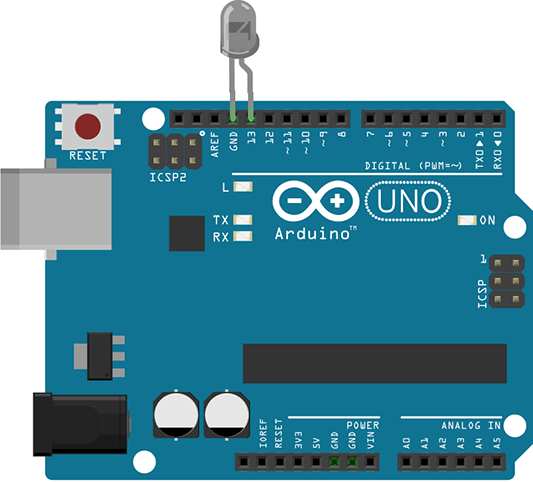

# What can JavaScript do?

<h3 class="fragment">Originally created to support dynamic web pages</h3>

<ul>
	<li class="fragment">interacting with the user<br />(clicks, keypresses, prompts)</li>
	<li class="fragment">adding, removing, altering page elements<br />(manipulating the <strong>D</strong>ocument <strong>O</strong>bject <strong>M</strong>odel)</li>
</ul>

<p class="fragment">It is ubiquitous today, one of the most popular programming languages.</p>

# Examples

## Animation
<iframe src="./examples/circles/index.html" style="background-color: #ffffff; width: 80rem; height: 30rem;">No frame support</iframe>
<small>(Example courtesy of <a href="http://gwennaelbuchet.github.io/SceneGraph.js" target="_blank">SceneGraph.js Framework</a>)</small>

## Showing up in places we never expected

<div class="fragment">
<h3>Outside of the browser</h3>


<p><a href="https://nodejs.org">https://nodejs.org</a></p>
</div>


## Internet of Things (IoT)

<div style="float: left; width: 20rem;">

</div>

<div class="fragment">
	<div style="float: right; width: 20rem;">
		
	</div>
	<div style="clear: right; float: right;">
		<h3>Like Johnny-Five!</h3>
		<p><a href="http://johnny-five.io" target="_blank">http://johnny-five.io</a></p>
	</div>
</div>

# This is JavaScript

```js
$(function() {
	$(".notVisited").click(function(event) {
		$(event.target).removeClass("notVisited");
		$(event.target).addClass("path");
	})
});
```
